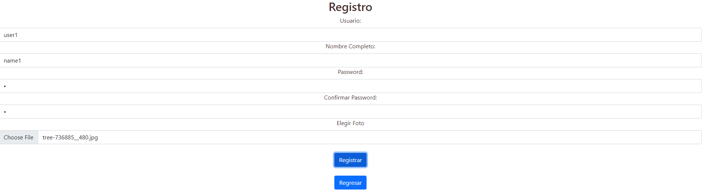
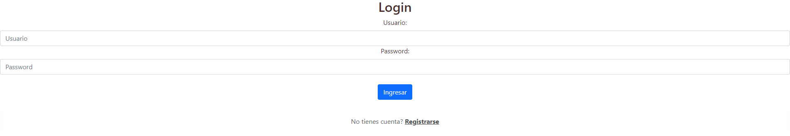
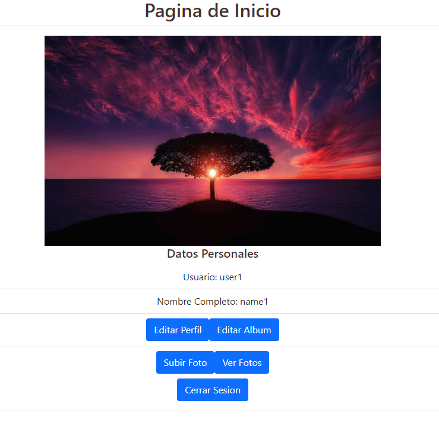
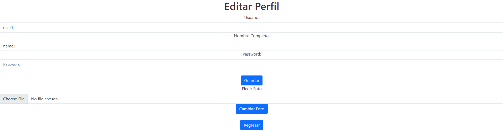
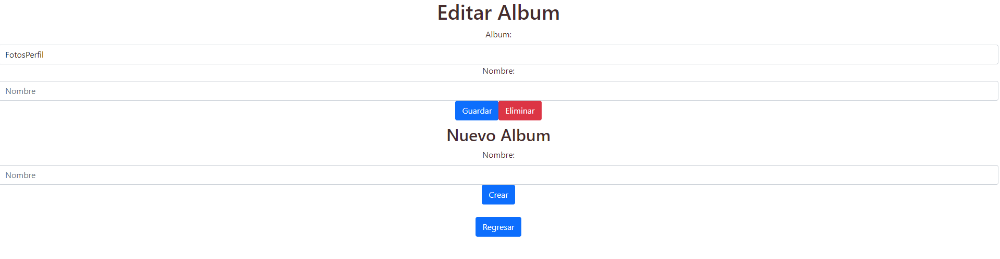
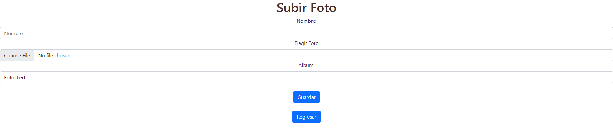
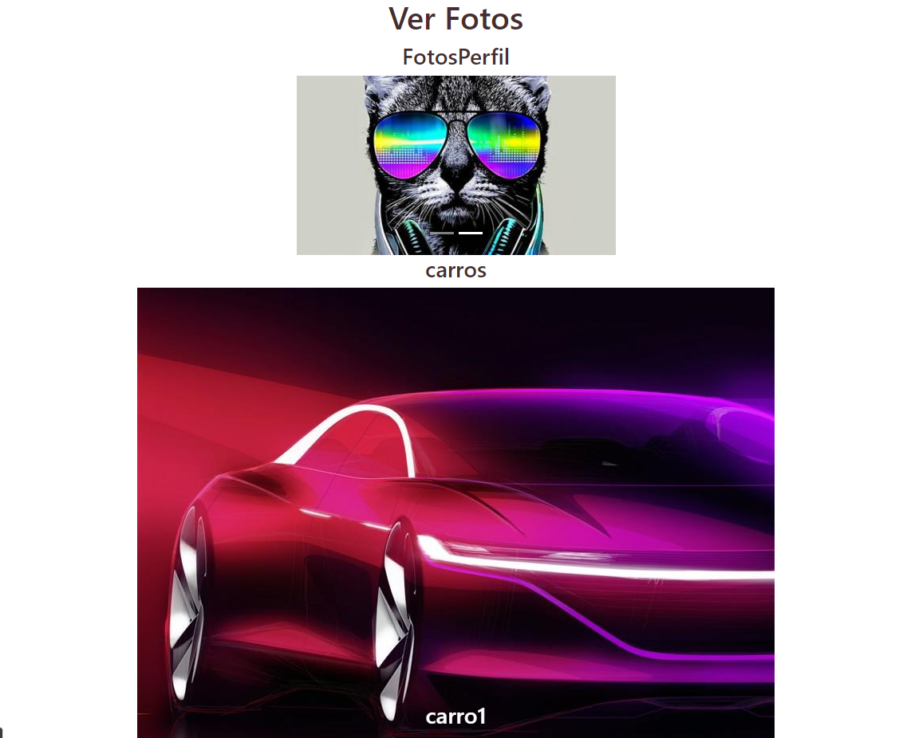

# Seminario de Sistemas 1
## _Practica 1_ 

### Datos Estudiantes
| Nombre | Carné |
| ------ | ------ |
| Carlos Raúl Campos Meléndez | 201800639 |
| José Alejandro Santizo Cotto | 201709309|
| Sergio Sebastian Chacón Herrera | 201709159 |
| Oscar Alfredo Llamas Lemus  | 201602625 |

## Descripción de la arquitectura utilizada

### Página web

Se realizó el frontend de la aplicación con REACT subida en un bucket de S3 público

### Balanceador de carga

Se utilizó el servicio de AWS Load Balancing, este nos permitirá redirigir el tráfico de las peticiones a algunos de los servidores de las instancias EC2.

### Servers

Se realizaron 2 servidores con las mismas funciones, montados en instancias EC2 con un Segurity group configurado únicamente para el puerto utilizado.

### Bucket imágenes

Se configuró un bucket en S3 para el alojamiento de las imágenes de manera pública para poder acceder a ellas a través de la página web.

### Base de datos

Se trabajó con MySql almacenada en una instancia RDS.

_10.27.02.png)

## Usuarios IAM utilizados y políticas

### EC2

Para el trabajo con los buckets EC2 se creó el usuario User_EC2 con la política AmazonEC2FullAccess

### S3

Para el trabajo con el bucket S3 se creó el usuario User_S3 con la política AmazonS3FullAccess

### RDS

Para el trabajo con la instancia RDS se creó el usuario User_RDS con la política AmazonRDSFullAccess

## Capturas de servicios AWS utilizados

### S3

_10.40.24.png)

_10.40.56.png)

### EC2

_10.47.17.png)

### RDS

_10.51.14.png)

### Página web

En esta sección se presentaran todas las pantallas de la aplcación web derrollada para la presente práctica.

##### Registro

En esta ventana es posible registrar un nuevo usuario a la base de datos para luego ingresar a la aplicación.
Se solicita nombre de usuario, el cual no puede ser repetido, contraseña, una confirmación de la contraseña 
para mayor seguridad y una foto de perfil seleccionada desde el dispositivo del usuario.

##### Ingreso

En la ventana de ingreso se solicita el nombre y contraseña del usuario.

##### Inicio

En esta ventana se presentan datos como el nombre del usuario, su nombre completo y su foto de perfil.
Desde el inicio es posible acceder a todas las funcionalidades que tiene la aplicación web.

##### Editar Perfil

Será posible editar el nombre de usuario, el nombre completo y la foto de perfil del usuario ingresado.
Para editar el nombre de usuario y el nombre completo será necesario ingresar la contraseña del usuario ingresado antes de guardar cambios.

##### Editar Album

En esta sección es posible editar, crear y eliminar un albúm existente del usuario ingresado.

##### Subir Foto

Es posible subir fotos a los albumes creados por el usuario por medio de esta ventana de la aplicación.

##### Ver Fotos

Todas las fotos subidas por el usuario a su foto de perfil y las imagenes que contienen los albúmes del usuario se
presentaran en esta sección de la aplicación web.
